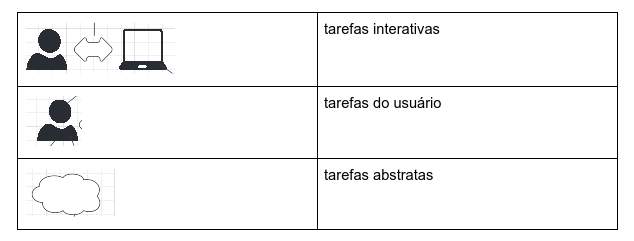
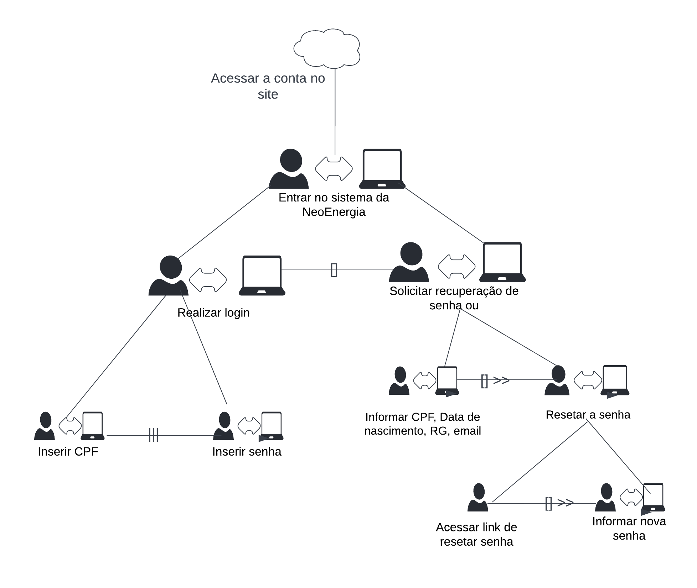
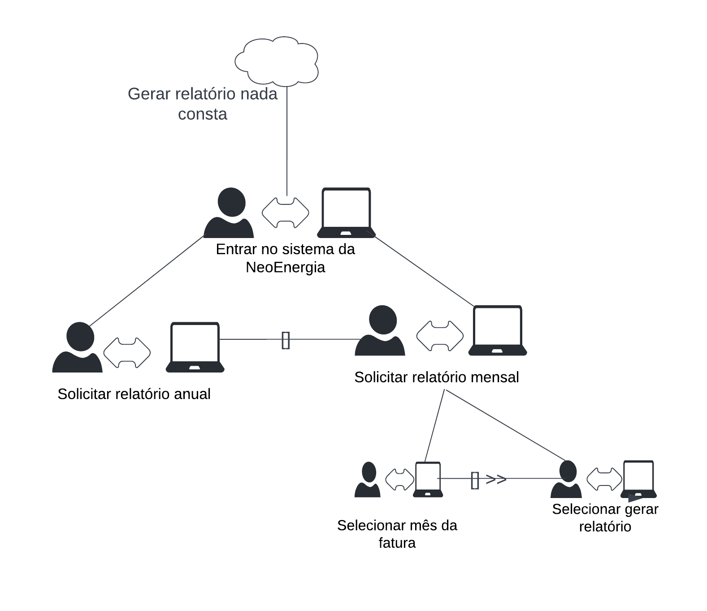

# Árvores de Tarefas Concorrentes

### Introdução

Dentro do processo de análise de tarefas, um dos métodos utilizados é o de Análise de Tarefas Concorrentes (CTT), em que, separa-se as tarefas entre: usuários, sistema, interativas e abstratas.  

Com a elaboração do CTT, é possível identificar tanto a hierarquia entre as atividades quanto as relações entre elas.

    As tarefas se subdividem em 4 tipos:
    <ul>
        <li>tarefas do usuário, que são feitas a parte do sistema</li>
        <li> tarefas do sistema, em que o usuário não participa da ação</li>
        <li> tarefas interativas, em que tanto o usuáio como o sistema fazem diálogo para sua realização </li>
        <li>tarefas abstratas, que representam um conjunto de tarefas</li>
    <ul>

|  | 
|:--:| 
| *Figura 1: Legenda das tarefas inseridas no CTT* |

### Diagrama de Análise de Tarefas Concorrentes

Dentro do site da NeoEnergia, foram escolhidas algumas tarefas para serem analisadas como mostra as Figuras 2 e 3.

|  | 
|:--:| 
| *Figura 2: Árvore de tarefas concorrentes referente ao acesso da conta no site* |

|  | 
|:--:| 
| *Figura 3: Árvore de tarefas concorrentes referente à geração do relatório de nada consta* |
## Bibliografia
> Barbosa, S. D. J.; Silva, B. S. da; Silveira, M. S.; Gasparini, I.; Darin, T.; Barbosa, G. D. J. (2021);Interação Humano-Computador e Experiência do usuário.

## Tabela de Versionamento
| Data | Versão | Descrição | Autor | Revisor |
| ---- | ------ | --------- | ----- | ------- |
| 16/07/2022 | `0.1`  | Criação da página de tarefas concorrentes | [Luíza Esteves](https://github.com/luiza-esteves) | [Matheus Perillo](https://github.com/MatheusPerillo)
