# Perfil do Usuário

## Introdução

O perfil de usuário é uma forma de entendermos quem são as pessoas que fazem uso do produto, e este documento tem como objetivo descrever as características dos usuários da Agência Virtual Neoenergia Brasília. Para entender quem são essas pessoas, perguntas como "Quem são?" ou "Quais seus objetivos?" devem ser respondidas de alguma forma. Isso pode ser feito por meio de entrevistas ou questionários, por exemplo.

## Metodologia

Para entender quem são os usuários, nossa equipe elaborou um questionário através do Google Forms com perguntas que possibilitassem o agrupamento de pessoas com características semelhantes para assim montarmos seus perfis e personas. Vale ressaltar que antes que o questionário iniciasse de fato, era necessário aceitar o seguinte termo de consentimento:

## Por que usar o perfil de usuário?

Visto que um perfil de usuário é caracterizado por dados sobre o próprio usuário, podemos observar a faixa de respostas para cada uma das características e a porcentagem de usuários nessa faixa, categorizando os usuários em grupos, com base em suas semelhanças. 

<b>Figura 1: Questão 1 (Termo de consentimento)</b>

## Questionário

Perguntas e percentuais de respostas

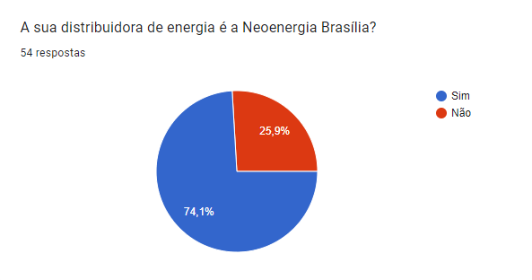

<b>Figura 2: Questão 2</b>

 

<b>Figura 3: Questão 3</b>

 

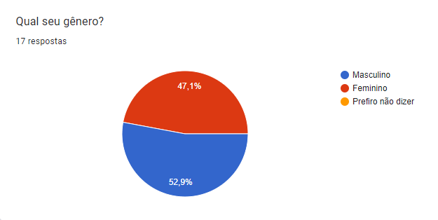

<b>Figura 4: Questão 4</b>

 

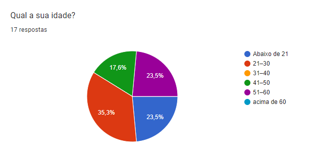

<b>Figura 5: Questão 5</b>

 

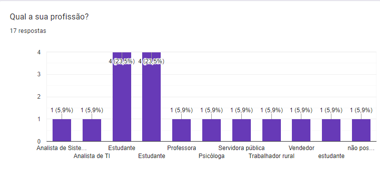

<b>Figura 6: Questão 6</b>

 

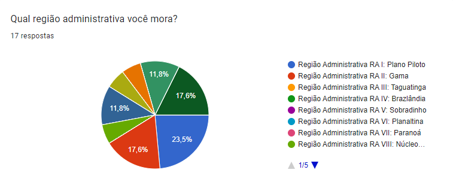

<b>Figura 7: Questão 7</b>

 

<b>Figura 8: Questão 8</b>

 

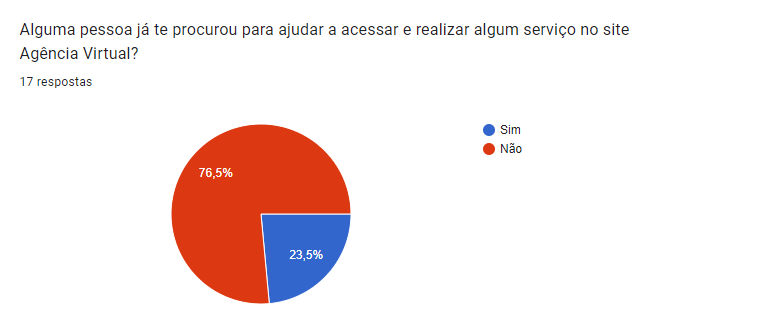

<b>Figura 9: Questão 9</b>

 

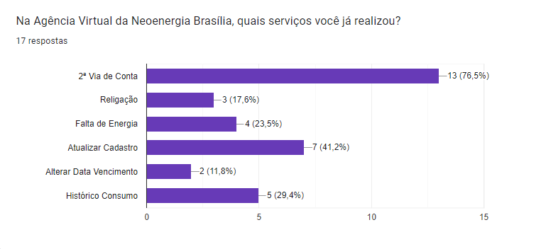

<b>Figura 10: Questão 10</b>

 

As questões a seguir são definidas pelos níveis de satisfação abaixo:

 

 

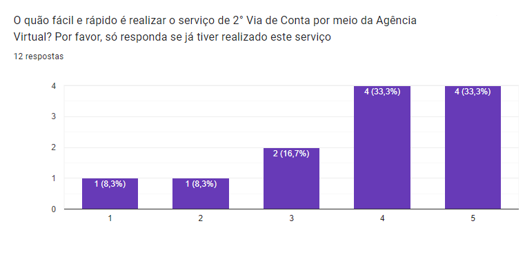

<b>Figura 11: Questão 11</b>

 

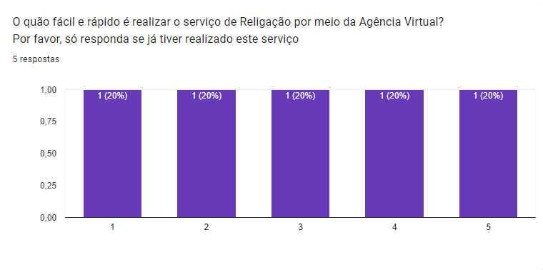

<b>Figura 12: Questão 12</b>

 

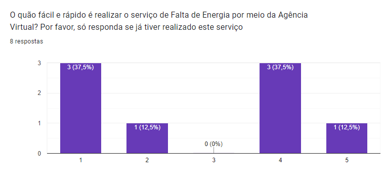

<b>Figura 13: Questão 13</b>

 

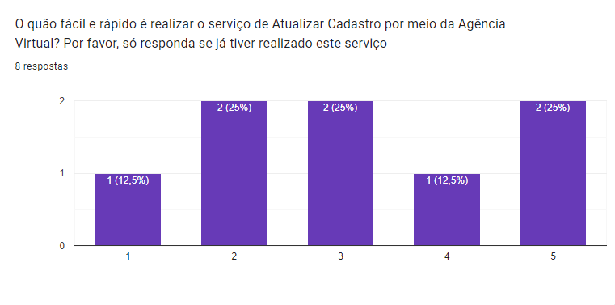

<b>Figura 14: Questão 14</b>

 

<b>Figura 15: Questão 15</b>

 

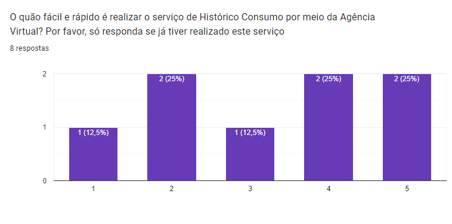

<b>Figura 16: Questão 16</b>

 

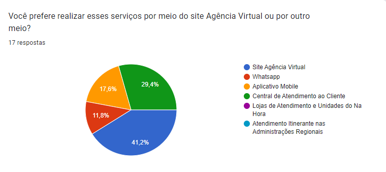

<b>Figura 17: Questão 17</b>

 

<b>Figura 18: Questão 18</b>

 

## Observações

Em posse dos dados obtidos com a aplicação do questionário, podemos perceber que a maioria do público são jovens adultos (entre 21 e 30) embora a diferença entre as porcentagens das respectivas faixas etárias não seja tão grande. Percebe-se também que muitas pessoas pediram ajuda para realizar alguma tarefa dentro do site, o que indica dificuldade no acesso aos serviços. Outro indicativo de dificuldade é o fato de que o percentual de pessoas que preferem utilizar o site é menor comparado ao percentual das outras alternativas, visto que o site tem uma premissa de ser algo mais objetivo, ao contrário da ceantral de atendimento ao cliente, por exemplo.

## Bibliografia
> Barbosa, S. D. J.; Silva, B. S. da; Silveira, M. S.; Gasparini, I.; Darin, T.; Barbosa, G. D. J. (2021);Interação Humano-Computador e Experiência do usuário.

| Data | Versão | Descrição | Autor | Revisor |
| ---- | ------ | --------- | ----- | ------- |
| 19/07/2022 | `0.1`  | Criação do artefato Perfil do Usuário | [Rafael Xavier](https://github.com/rafaelxavierr) | [Clara Ribeiro](https://github.com/clara-ribeiro)
