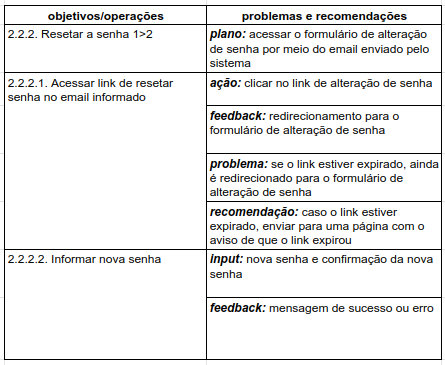
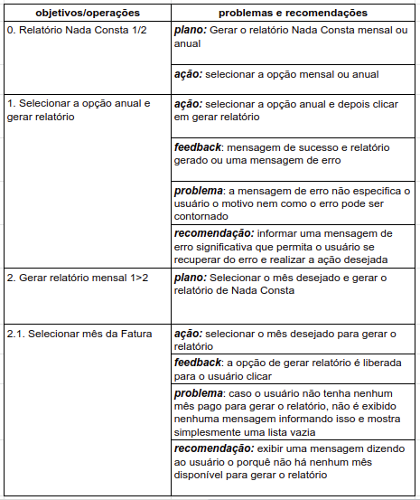

# Análise Hierárquica de Tarefas

## Introdução

A análise de tarefas consiste em observar os objetivos que os usuário desejam alcançar e estudar como eles o realizam e porquê com a finalidade de identificar problemas e melhorias às tarefas existentes em certo sistema.

Para realizar tal análise, existe alguns métodos diferentes. Nesta página sera discutida e mostrada a análise hierárquica de tarefas realizada sobre algumas tarefas críticas do site Agência Virtual NeoEnergia. A Análise Hierárquica de Tarefas (HTA – Hierarchical Task Analysis) possui a finalidade de identificar problemas de desempenho de tarefas complexas e não repetitivas, além de buscar entender as competências e habilidades exibidas nas mesmas (Annett, 2003; Annett e Duncan, 1967).

A HTA busca pegar objetivos maiores que podem ser decompostos em subobjetivos e/ou operações até que o objetivo maior seja atingido. Assim cada objetivo e operação dentro dessa hierarquia é examinado atrás de possíveis erros e soluções.

As tarefas selecionadas para essa avaliação foram a de "Acessar a conta no site" e "Relatório Nada Consta" pois foram as tarefas que tiveram problemas de interface identificados na avaliação heurística realizada anteriormente (A avaliação heurística pode ser encontrada neste link).

## Diagramas e tabelas

### Acessar a conta no site

A tarefa "Acessar a conta no site" é uma das principais tarefas do sistema, já que a sua execução é a que permite o usuário a navegar pelo sistema e realizar outras ações. Nesta tarefa foram identificadas alguns problemas dentro de alguns subobjetivos e operações. Assim, abaixo será apresentado a análise HTA da mesma idenficando onde estão os problemas e levantando recomendações de melhoria.

A Figura 1 apresenta o diagrama da análise da tarefa "Acessar a conta no site" e na Figura 2 e 3 é apresentado a representação da HTA em tabela desta mesma tarefa.

    Figura 1: Diagrama HTA da primeira tarefa

{width="900"}

    Figura 2: Parte 1 da Tabela HTA

{width="900"}

    Figura 3: Parte 2 da Tabela HTA

### Relatório Nada Consta

A tarefa de "Relatório Nada Consta" consiste em gerar um documento que informa ao usuário que não há contas com o pagamento pendente.

A Figura 4 apresenta o diagrama da análise da tarefa "Relatório Nada Consta" e na Figura 5 e 6 é apresentado a representação da HTA em tabela desta mesma tarefa.

    Figura 4: Diagrama HTA da segunda tarefa

{width="900"}

    Figura 5: Parte 1 da Tabela HTA

{width="900"}

    Figura 6: Parte 2 da Tabela HTA

## Bibliografia
> Barbosa, S. D. J.; Silva, B. S. da; Silveira, M. S.; Gasparini, I.; Darin, T.; Barbosa, G. D. J. (2021);Interação Humano-Computador e Experiência do usuário.

## Tabela de Versionamento

| Data | Versão | Descrição | Autor | Revisor |
| ---- | ------ | --------- | ----- | ------- |
| 18/07/2022 | `0.1`  | Criação da página de análise hierárquica | [Natan Santana](https://github.com/Neitan2001) | [Luíza Esteves](https://github.com/luiza-esteves)
