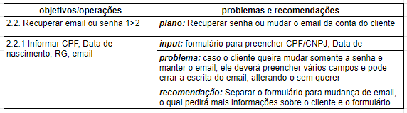

# Avaliação da Análise de tarefas

## Introdução

O seguinte documento apresentará o relato das entrevistas realizadas por Natan Tavares Santana e Clara Ribeiro no dia 12/08/2022, especificando o objetivo da avaliação, os dados coletados e as suas interpretações.

## Objetivo

Durante a etapa de Análise de Requisitos, foi feita a análise de duas tarefas do site Agência Virtual NeoEnergia a fim de identificar problemas de usabilidade e possíveis correções. Essa análise foi realizada pelo método de inspeção utilizando a Análise Hierárquica de Tarefas (HTA) e, a fim de validar o que foi levantado pelos avaliadores, o grupo decidiu realizar entrevistas com pessoas que se encaixam no perfil de usuários levantado. Os dados coletados durante essas entrevistas servirão para complementar o que foi feito pelos avaliadores, garantindo que a visão do usuário seja levada em conta antes do grupo prosseguir para as próximas etapas do projeto.

## Método

O método utilizado pelo grupo a fim de validar a análise de tarefas foi a entrevista a qual trata-se de uma conversa guiada por um roteiro de perguntas ou tópicos, na qual um entrevistador busca obter informação de um entrevistado (Seidman, 2019). A fim de recolher dados que possam ajudar a complementar as análises feitas previamente, foi decidido executar uma entrevista semiestruturada a qual possui um roteiro de perguntas e permite ao entrevistador ter uma liberdade para mudar a ordem dos tópicos abordados e explorar as respostas fornecidas pelo entrevistado, tendo em mente o foco nos objetivos da entrevista.

## Avaliadores e Participantes

As entrevistas foram conduzidas pelos avaliadores Natan Tavares Santana e Clara Ribeiro. Para cada participante, foi realizado uma única entrevista dividida em duas partes: a de Análise de Tarefas e a do Storyboard. Durante a parte de Análise de Tarefas, o entrevistado Natan ficou responsável por fazer as perguntas e a Clara por fazer as anotações.

Com a finalidade de preservar o anonimato dos participantes, os nomes reais não serão utilizados e será usado nomes fictícios durante o relato dos dados coletados. O primeiro entrevistado, o qual será chamado de Jorge, possui 43 anos, trabalha como Desenvolvedor de Software e é responsável por pagar a conta de energia da casa dele. Já o segundo entrevistado, o qual será chamado de Felipe, possui 22 anos, trabalha como Desenvolvedor de Aplicativos e é responsável por pagar a conta de energia da casa dele. Os dois entrevistados se encaixam dentro do perfil de usuário levantado durante a fase de Análise de Requisitos, Jorge estando na faixa de 41-50 anos e Felipe na faixa de 21-30 anos. Além disso, ambos são responsáveis pela conta de energia, possuindo as mesmas necessidades dos usuários que acessam a Agência Virtual da NeoEnergia.

## Sumário dos dados

### Jorge

| Pergunta | Resposta |
| ---- | ------ | 
|  Qual é a sua idade? | 43 anos  | 
|  Com o que você trabalha? | Desenvolvimento de Software  | 
|  É você quem paga a conta de energia na sua casa? | Sim  |
|  De acordo com os problemas e recomendações levantadas para o item 1 da tarefa "Acessar conta no site", você concorda com o que foi dito ou possui alguma sugestão? | Sim, e o sistema deveria pedir o consentimento do usuário para enviar um email mesmo que seja de confirmação  | 
|  De acordo com os problemas e recomendações levantadas para o item 2.2.1 da tarefa "Acessar conta no site", você concorda com o que foi dito ou possui alguma sugestão? | Sim, além da sugestão levantada, no formulário de alteração de email deve ter um campo de confirmar o email a fim de evitar que o usuário erre a digitação |
| De acordo com os problemas e recomendações levantadas para o item 2.2.2.1 da tarefa "Acessar conta no site", você concorda com o que foi dito ou possui alguma sugestão? | Sim |
|  observando o digrama de análise de tarefas hierárquica da funcionalidade "Acessar conta no site", você identifica que a sequência das atividades e os feedbacks recebidos sejam coerentes? | Sim | 
| De acordo com os problemas e recomendações levantadas para o item 1 da tarefa "Relatório Nada Consta", você concorda com o que foi dito ou possui alguma sugestão? | Sim |
| De acordo com os problemas e recomendações levantadas para o item 2.1 da tarefa "Relatório Nada Consta", você concorda com o que foi dito ou possui alguma sugestão? | Sim |
| observando o digrama de análise de tarefas hierárquica da funcionalidade "Relatório Nada Consta", você identifica que a sequência das atividades e os feedbacks recebidos sejam coerentes? | Sim |

### Felipe

| Pergunta | Resposta |
| ---- | ------ | 
|  Qual é a sua idade? | 22 anos  | 
|  Com o que você trabalha? | Desenvolvimento de Aplicativos  | 
|  É você quem paga a conta de energia na sua casa? | Sim  |
|  De acordo com os problemas e recomendações levantadas para o item 1 da tarefa "Acessar conta no site", você concorda com o que foi dito ou possui alguma sugestão? | Sim  | 
|  De acordo com os problemas e recomendações levantadas para o item 2.2.1 da tarefa "Acessar conta no site", você concorda com o que foi dito ou possui alguma sugestão? | Sim |
| De acordo com os problemas e recomendações levantadas para o item 2.2.2.1 da tarefa "Acessar conta no site", você concorda com o que foi dito ou possui alguma sugestão? | Sim |
|  observando o digrama de análise de tarefas hierárquica da funcionalidade "Acessar conta no site", você identifica que a sequência das atividades e os feedbacks recebidos sejam coerentes? | Sim | 
| De acordo com os problemas e recomendações levantadas para o item 1 da tarefa "Relatório Nada Consta", você concorda com o que foi dito ou possui alguma sugestão? | Sim |
| De acordo com os problemas e recomendações levantadas para o item 2.1 da tarefa "Relatório Nada Consta", você concorda com o que foi dito ou possui alguma sugestão? | Sim |
| observando o digrama de análise de tarefas hierárquica da funcionalidade "Relatório Nada Consta", você identifica que a sequência das atividades e os feedbacks recebidos sejam coerentes? | Sim |

## Problemas encontrados

A seguir será listado os problemas encontrados pelos entrevistados:

- Item 1 da tarefa "Acessar conta no site": O sistema deveria pedir o consentimento do usuário para enviar um email mesmo que seja de confirmação
- Item 2.1 da tarefa "Acessar conta no site": Jorge identificou um problema que não tinha sido levantado, o sistema não possui um limite de tentativa de acesso da conta, permitindo que alguém tente várias senhas para invadir a conta de outra pessoa. A recomendação seria colocar um limite de tentativas que, quando atingido, bloqueasse a conta do usuário e enviasse um email para a liberação da conta
- Item 2.2.1 da tarefa "Acessar conta no site": No formulário de alteração de email deve ter um campo de confirmar o email a fim de evitar que o usuário erre a digitação

## Sugestões de correções

De acordo com os dados levantados, será necessário realizar algumas alterações nas tabelas de HTA da tarefa "Acessar conta no site". As tabela com as alterações podem ser observadas nas figuras 1 e 2 abaixo:

{width="900"}

    Figura 1: Parte 1 da Tabela HTA da tarefa "Acessar Conta no Site"

{width="900"}

    Figura 2: Parte 2 da Tabela HTA da tarefa "Acessar Conta no Site"

## Conclusão

As entrevistas para validação da Análise de Tarefas conseguiram levantar alguns problemas e recomendações que não tinham sido observados pela Análise de Tarefas feita previamente pelo método de inspeção, mais especificamente na tarefa de "Acessar conta no site". Os problemas e recomendações levantados serão úteis durante as próximas fases do projeto e ajudarão a guiar o time nas decisões de design e na definição do modelo conceitual da remodulação do sistema.

## Bibliografia
> Barbosa, S. D. J.; Silva, B. S. da; Silveira, M. S.; Gasparini, I.; Darin, T.; Barbosa, G. D. J. (2021);Interação Humano-Computador e Experiência do usuário.

## Tabela de Versionamento

| Data | Versão | Descrição | Autor | Revisor |
| ---- | ------ | --------- | ----- | ------- |
| 14/08/2022 | `0.1`  | Criação do documento de relato da avaliação da análise de tarefas | [Natan Santana](https://github.com/Neitan2001) | [Clara Ribeiro](https://github.com/clara-ribeiro)