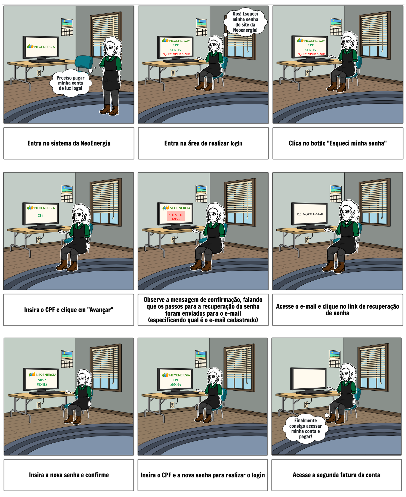
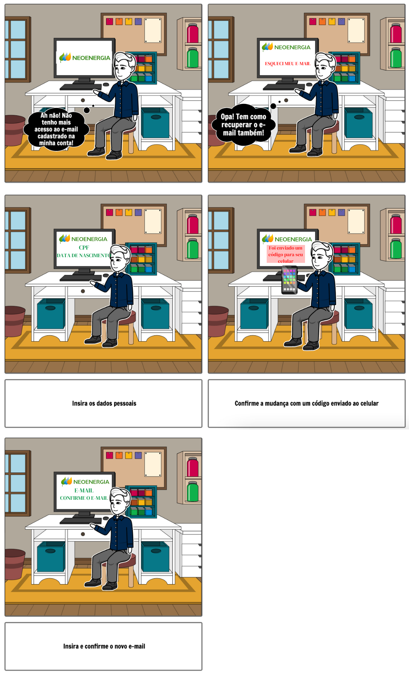
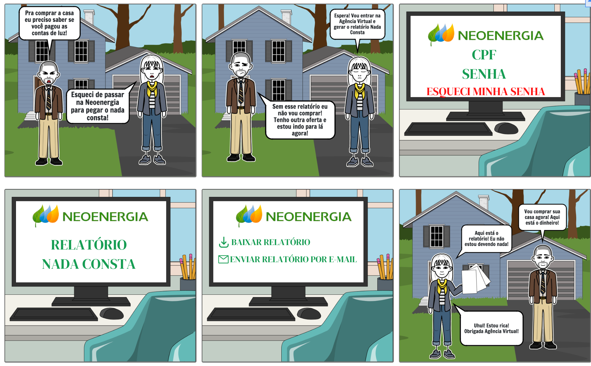
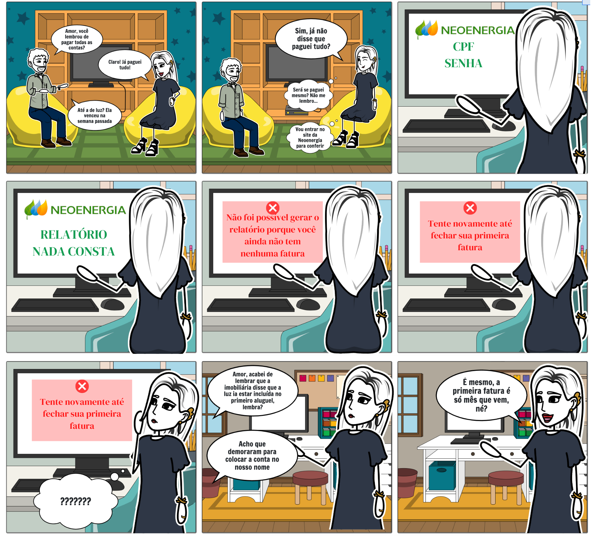

# Avaliação do Storyboard

## Introdução

O seguinte documento apresentará o relato das entrevistas realizadas por Natan Tavares Santana e Clara Ribeiro no dia 12/08/2022, especificando o objetivo da avaliação, os dados coletados e as suas interpretações.

## Objetivo

Durante a confecção dos [storyboards](../storyboard/planejamento_storyboard.md), foram identificadas tarefas com capacidade de melhoria, criando o que seria um cenário ideal para as mesmas. E é de extrema importância que tais cenários sejam validados por usuários reais do sistema, a fim de chegarmos no melhor resultado possível. Os dados obtidos nas entrevistas foram utilizados para complementar os storyboards feitos anteriormente.

## Método

O método utilizado pelo grupo a fim de validar os storyboards foi a entrevista, a qual trata-se de uma conversa guiada por um roteiro de perguntas ou tópicos, na qual um entrevistador busca obter informação de um entrevistado (Seidman, 2019). A fim de recolher dados que possam ajudar a complementar os storyboards feitos anteriormente, foi decidido executar uma entrevista semiestruturada a qual possui um roteiro de perguntas e permite ao entrevistador ter uma liberdade para mudar a ordem dos tópicos abordados e explorar as respostas fornecidas pelo entrevistado, tendo em mente o foco nos objetivos da entrevista.

## Avaliadores e Participantes

As entrevistas foram conduzidas pelos avaliadores Natan Tavares Santan e Clara Ribeiro. Para cada participante, foi realizado uma única entrevista dividida em duas partes: a de Análise de Tarefas e a do Storyboard. Durante a parte de Storyboards, a entrevistadora Clara ficou responsável por fazer as perguntas e o Natan por fazer as anotações.

Com a finalidade de preservar o anonimato dos participantes, os nomes reais não serão utilizados e será usado nomes fictícios durante o relato dos dados coletados. O primeiro entrevistado, o qual será chamado de Jorge, possui 43 anos, trabalha como Desenvolvedor de Software e é responsável por pagar a conta de energia da casa dele. Já o segundo entrevistado, o qual será chamado de Felipe, possui 22 anos, trabalha como Desenvolvedor de Aplicativos e é responsável por pagar a conta de energia da casa dele. Os dois entrevistados se encaixam dentro do perfil de usuário levantado durante a fase de Análise de Requisitos, Jorge estando na faixa de 41-50 anos e Felipe na faixa de 21-30 anos. Além disso, ambos são responsáveis pela conta de energia, possuindo as mesmas necessidades dos usuários que acessam a Agência Virtual da NeoEnergia.

## Sumário dos dados

### Jorge

| Pergunta | Resposta |
| ---- | ------ | 
|  Qual é a sua idade? | 43 anos  | 
|  Com o que você trabalha? | Desenvolvimento de Software  | 
|  É você quem paga a conta de energia na sua casa? | Sim  |
|  Observando o storyboard de recuperação de senha, você identifica que a sequência das atividades seja coerente? | Sim, mas eu adicionaria um campo de confirmação de e-mail de recuperação da senha |
|  O que você pensa sobre a solução da tarefa do sistema da NeoEnergia no Storyboard? Ela está atendendo ou faltam elementos? | Está faltando a validação do e-mail |
|  Observando o storyboard de recuperação de e-mail, você identifica que a sequência das atividades seja coerente? | Está coerente, mas os dados de recuperação são bem simples, seria interessante colocar uma validação em duas etapas, usando o telefone celular, para garantir mais a segurança da conta |
|  O que você pensa sobre a solução da tarefa do sistema da NeoEnergia no Storyboard? Ela está atendendo ou faltam elementos? | Não, só a ressalva da validação em duas etapas. Seria bom informar ao cliente o que ele deve fazer caso não tenha mais acesso nem ao e-mail nem ao celular |
|  Observando o storyboard de geração do relatório nada consta com sucesso, você identifica que a sequência das atividades seja coerente? | Sim, está coerente |
|  O que você pensa sobre a solução da tarefa do sistema da NeoEnergia no Storyboard? Ela está atendendo ou faltam elementos? | Ter a opção de enviar o documento por e-mail |
|  Observando o storyboard de geração do relatório nada consta com mensagem de erro, você identifica que a sequência das atividades seja coerente? | Sim |
|  O que você pensa sobre a solução da tarefa do sistema da NeoEnergia no Storyboard? Ela está atendendo ou faltam elementos? | Não, somente isso já está adequado |

### Felipe

| Pergunta | Resposta |
| ---- | ------ | 
|  Qual é a sua idade? | 22 anos  | 
|  Com o que você trabalha? | Desenvolvimento de Aplicativos  | 
|  É você quem paga a conta de energia na sua casa? | Sim  |
|  Observando o storyboard de recuperação de senha, você identifica que a sequência das atividades seja coerente? | Sim, faz sentido |
|  O que você pensa sobre a solução da tarefa do sistema da NeoEnergia no Storyboard? Ela está atendendo ou faltam elementos? | Sim, está atendendo |
|  Observando o storyboard de recuperação de e-mail, você identifica que a sequência das atividades seja coerente? | Sim, achei legal pedir vários dados para a recuperação |
|  O que você pensa sobre a solução da tarefa do sistema da NeoEnergia no Storyboard? Ela está atendendo ou faltam elementos? | Sim, atende |
|  Observando o storyboard de geração do relatório nada consta com sucesso, você identifica que a sequência das atividades seja coerente? | Sim |
|  O que você pensa sobre a solução da tarefa do sistema da NeoEnergia no Storyboard? Ela está atendendo ou faltam elementos? | Sim, atende |
|  Observando o storyboard de geração do relatório nada consta com mensagem de erro, você identifica que a sequência das atividades seja coerente? | Sim, está bastante claro e informativo |
|  O que você pensa sobre a solução da tarefa do sistema da NeoEnergia no Storyboard? Ela está atendendo ou faltam elementos? | Sim, está atendendo |

## Problemas encontrados

A seguir será listado os problemas encontrados pelos entrevistados:

- Recuperação de senha: Jorge disse que seria importante ter uma mensagem informando qual e-mail seria usado para a recuperação de senha.
- Recuperação de e-mail: Jorge disse que os dados pedidos para a recuperação do e-mail são de fácil acesso e seria mais seguro caso fosse usada a validação em duas etapas, utilizando o celular para validar essa troca de e-mails.
- Recuperação de e-mail: Jorge disse que é importante ter uma descrição sobre o que o usuário deve fazer caso não tenha mais acesso ao e-mail e nem ao celular usado na validação.
- Relatório nada consta: Foi identificado que seria útil caso tivesse a opção de enviar o documento por e-mail.

## Aplicação das Sugestões

Os storyboards foram refeitos incluindo as sugestões oferecidas nas entrevistas. Na Figura 1, podemos ver o storyboard de recuperação de senha, com a adição de uma mensagem informando ao usuário qual e-mail ele deve acessar para conseguir completar o processo, conforme foi sugerido por um dos entrevistados.

Figura 1 - Storyboard de recuperação de senha

Na Figura 2, podemos ver o storyboard de recuperação de e-mail, com a adição da validação em duas etapas, conforme sugerido.

Figura 2 - Storyboard de recuperação de e-mail

Nas Figuras 3 e 4, podemos ver os storyboards da geração do relatório nada consta. Na Figura 3 foi adicionada a função de enviar o relatório por e-mail, conforme o feedback recebido nas entrevistas.

Figura 3 - Storyboard de geração do relatório nada consta

  

Figura 4 - Storyboard de geração do relatório nada consta com erro

## Conclusão

As entrevistas conseguiram levantar pontos importantes que não haviam sido pensados em cada tarefa, contribuindo para a elaboração de novos storyboards.

## Bibliografia
> Barbosa, S. D. J.; Silva, B. S. da; Silveira, M. S.; Gasparini, I.; Darin, T.; Barbosa, G. D. J. (2021);Interação Humano-Computador e Experiência do usuário.

## Tabela de Versionamento

| Data | Versão | Descrição | Autor | Revisor |
| ---- | ------ | --------- | ----- | ------- |
| 16/08/2022 | `0.1`  | Criação do documento de relato da entrevista dos Storyboards | [Clara Ribeiro](https://github.com/clara-ribeiro) | [Natan Santana](https://github.com/Neitan2001) |