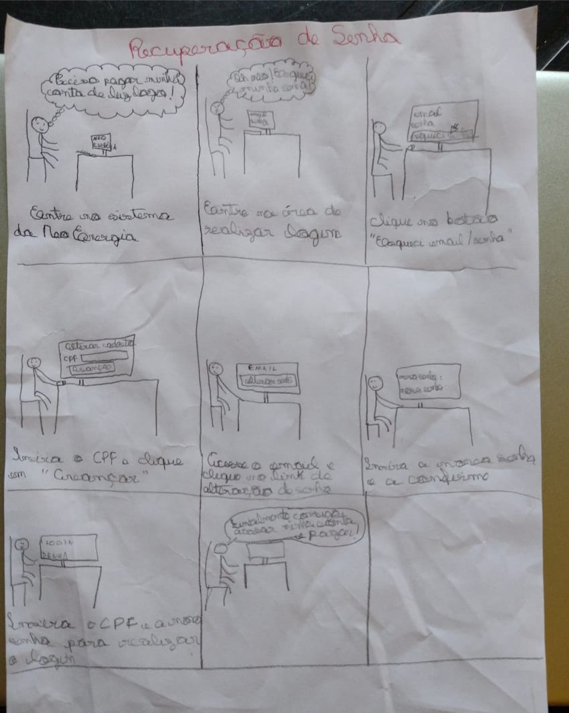
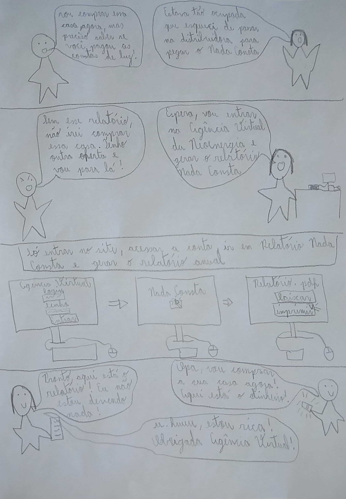
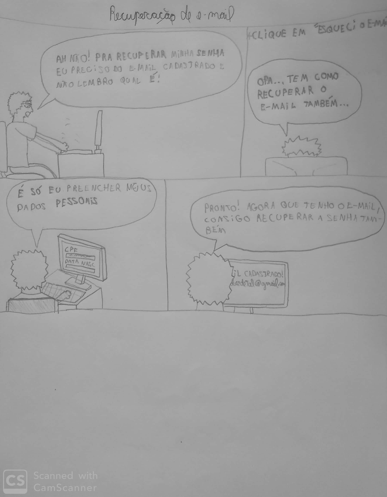
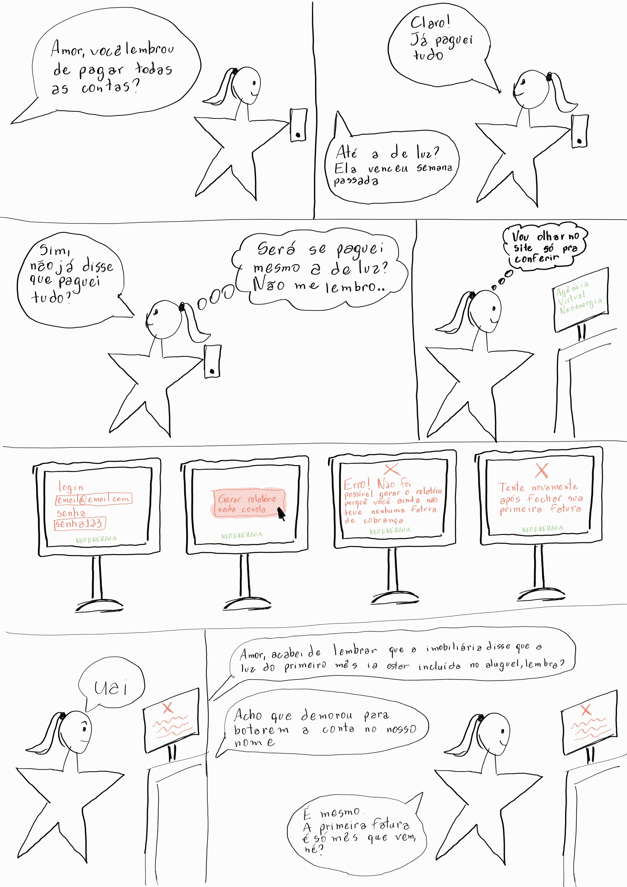

# Planejamento da avaliação do Storyboard

## Introdução

O Storyboard é uma forma de prototipação de baixa fidelidade, em que são utilizados desenhos que mostram a evolução de um usuário na realização de uma tarefa, indicando um caminho ideal para concluí-la com sucesso. Ao ser colocado junto com os cenários, traz uma riqueza de detalhes e informações muito maior para o projeto.

Suas principais vatangens ao ser executado são: baixo custo para ser desenvolvido, identifica requisitos, fácil comunicação e avalia vários conceitos do design. Nesse documento, será feita a descrição de como será feita a análise e avaliação dos storyboards desenvolvidos pela equipe.

## Metodologias de avaliação dos Storyboards

Dentro do nosso escopo de formas de avaliações, chegamos a um entendimento de que a forma mais adequada para o nosso projeto de se avaliar o storyboard são com entrevistas com os usuários, fazendo uma investigação técnica.

Assim, começamos o processo de estruturação montando um termo de consentimento específico para a entrevista, fizemos a análise de ferramentas necessárias, definimos um roteiro de perguntas a serem utilizadas para a avaliação, podendo serem acrescidas mais caso seja de valia para a avaliação e fizemos a escolha de perfis para a entrevista.

## Termo de consentimento

Dentro do termo, buscamos informar tanto sobre a pesquisa quanto a gravação das entrevistas, deixando claro que tudo ocorrerá garantindo o sigilo das informações e somente com a devida autorização.
  
<embed src="../../../../assets/termoConsentimento.pdf" type="application/pdf" width="700" height="500">

## Ferramentas utilizadas na avaliação

Para realizar a entrevista utilizaremos como ferramenta o Microsoft Teams, que permite tanto a comunicação quanto a gravação do encontro. Além disso, solicitaremos que o candidato esteja com lápis e papel caso deseje fazer algum esboço de seu raciocínio.

## Teste Piloto

Antes da entrevista com os participantes selecionados ser realizada, será feito um teste piloto a fim de verificar o planejamento, analisar se a avaliação produz os dados necessários e verificar se todas as ferramentas necessárias para a avaliação estão funcionando como planejado. O teste piloto consistirá de dois avaliadores executando a avaliação como se fosse uma sessão normal da entrevista e a gravação deste teste e os seus resultados serão documentados no relato dos resultados e qualquer mudança necessária no planejamento será feita antes que as entrevistas ocorram.

## Perfis dos entrevistados

Dentro da atividade de Perfil do Usuário e das Personas, conseguimos identificar características necessárias para realizar uma entrevista com um usuário. Sendo assim buscaremos dois perfis maiores de 18 anos, que residam no Distrito Federal e que faça utilização do site da Agência Virtual NeoEnergia.

## Roteiro de perguntas

| Número | Pergunta | Possível Resposta |
|:--:|:--:|:---|
| 1 | Observando o storyboard da tarefa "Recuperação de senha", você identifica que a sequência das atividades seja coerente? | <ul> <li> SIM</li> <li>  NÃO </li> <li> INCONCLUSIVO</li> </ul> |
| 1.1 | Se a resposta à pergunta 1 foi NÃO ou INCONCLUSIVO, pode explicar o motivo da resposta? E você possui alguma sugestão de melhoria? | Pergunta discursiva |
| 2 | Observando o storyboard da tarefa "Relatório Nada Consta anual", você identifica que a sequência das atividades seja coerente? | <ul> <li> SIM</li> <li>  NÃO </li> <li> INCONCLUSIVO</li> </ul> |
| 2.1 | Se a resposta à pergunta 2 foi NÃO ou INCONCLUSIVO, pode explicar o motivo da resposta? E você possui alguma sugestão de melhoria? | Pergunta discursiva |
| 3 | Observando o storyboard da tarefa "Recuperação de email", você identifica que a sequência das atividades seja coerente? | <ul> <li> SIM</li> <li>  NÃO </li> <li> INCONCLUSIVO</li> </ul> |
| 3.1 | Se a resposta à pergunta 3 foi NÃO ou INCONCLUSIVO, pode explicar o motivo da resposta? E você possui alguma sugestão de melhoria? | Pergunta discursiva |
| 4 | Observando o storyboard da tarefa "Relatório Nada Consta mensal", você identifica que a sequência das atividades seja coerente? | <ul> <li> SIM</li> <li>  NÃO </li> <li> INCONCLUSIVO</li> </ul> |
| 4.1 | Se a resposta à pergunta 4 foi NÃO ou INCONCLUSIVO, pode explicar o motivo da resposta? E você possui alguma sugestão de melhoria? | Pergunta discursiva |

## Storyboards desenvolvidos

Para a realização da avaliação de storyboard, os membros do grupo desenvolveram storyboards das seguintes atividades do sistema: recuperação de senha, recuperação de email e relatório nada consta. 

Na Figura 1, é colocado a recuperação de senha no contexto em que o usuário entra no site do sistema para realizar uma atividade mas acaba se esquecendo sua senha e precisa iniciar o processo de recuperação.

Figura 1- Storyboard de recuperação de senha (Luíza Esteves)

 

Na Figura 2, é contada uma história de uma pessoa emitindo um relatório nada consta para o aluguel de uma casa.

Figura 2- Storyboard de relatório nada consta (Natan Santana)

Na Figura 3, é colocado a recuperação de email para que o usuário consiga ter acesso a atividades do sistema

Figura 3- Storyboard de recuperação de email (Rafael Xavier)

Na Figura 4, é colocado o relatório nada consta para verificar se as contas realmente estão pagas

Figura 3- Storyboard de relatório nada consta (Clara Ribeiro)

## Conclusão 

Com todos esse planejamento, esperamos conseguir identificar todos os pontos a serem melhorados e os que estão em um bom nível para passar para as próximas etapas do design.

## Tabela de Versionamento

| Data | Versão | Descrição | Autor | Revisor |
| ---- | ------ | --------- | ----- | ------- |
| 04/08/2022 | `0.1`  | Criação da página de planejamento de storyboard | [Luíza Esteves](https://github.com/luiza-esteves) | [Natan Santana](https://github.com/Neitan2001)
| 10/08/2022 | `0.2`  | Ajuste nas perguntas e adição do tópico de teste piloto | [Natan Santana](https://github.com/Neitan2001) |
| 11/08/2022 | `0.3`  | Ajuste nas perguntas de acordo com o que foi observado no teste piloto | [Natan Santana](https://github.com/Neitan2001) |
