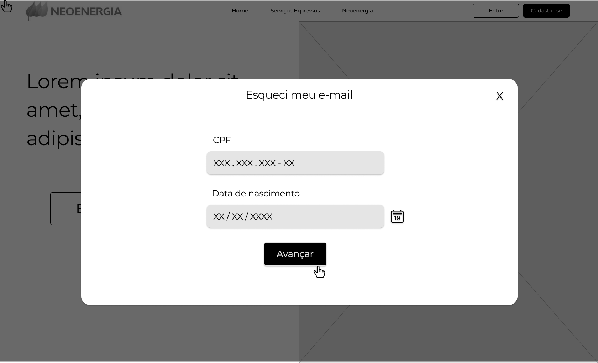

# Protótipo de Baixa Fidelidade

## Introdução

A prototipação em papel é um processo bastante presente na criação de interfaces. Essa prototipação foca nas funcionalidades e é centrada no usuário, possibilitando uma visão panorâmica da aplicação. A usabilidade é representada no protótipo, através de simulações com potenciais usuários. Por não ser uma solução executável, simular o uso é um modo barato e rápido de avaliação do design, permitindo mudanças sem nenhum prejuízo.

## Objetivo

O objetivo de fazer o protótipo de baixa fidelidade é avaliar a interface e identificar no início possíveis problemas de usabilidade. Esse documento irá apresentar os protótipos feitos da atividade de login, recuperação de senha e geração do relatório nada consta. As soluções da interface foram propostas com base nas avaliações da Análise de Tarefas e do Storyboard.

## Metodologia

Foi realizada uma prototipação vertical, ou seja, o protótipo realizado foca em um grupo definido de atividades, não abordando o sistema inteiro. As atividades exploradas foram as de login, recuperação de senha e geração do relatório nada consta. O software utilizado para a prototipação foi o Figma.

## Protótipos

### Login

Figura 1 - Protótipo da hero da tela inicial

 

Figura 2 - Protótipo da tela de login

 

Em relação a inferface já existente, as mudanças nessa proposta foram: adição do botão de login e cadastro na barra de menu, opção de manter o usuário conectado e as opções de recuperação de senha e de e-mail foram aplicadas de forma separada.

### Recuperação de senha

Figura 3 - Tela 1 de recuperação de senha

 

Figura 4 - Tela 2 de recuperação de senha

 

Figura 5 - Tela 3 de recuperação de senha

 

Figura 6 - Tela 4 de recuperação de senha

 

Figura 7 - Tela 5 de recuperação de senha

 

O fluxo de recuperação de senha proposto se difere bastante da versão original, a proposta foi separar a recuperação de senha e e-mail. Para recuperar a senha, o usuário deve apenas inserir o CPF e será enviado as informações de recuperação ao e-mail cadastrado.

### Recuperação de e-mail

Figura 8 - Tela 1 de recuperação de e-mail

 

Figura 9 - Tela 2 de recuperação de e-mail

 

Figura 10 - Tela 3 de recuperação de e-mail

 

Figura 11 - Tela 4 de recuperação de e-mail

 

Figura 12 - Tela 5 de recuperação de e-mail

 

Figura 13 - Tela 6 de recuperação de e-mail

 

Por questões de segurança, foi proposto a inserção de uma verificação em duas etapas ao fazer a recuperação do e-mail, já que os dados solicitados (CPF e data de nascimento) podem ser acessados por terceiros.

Caso o usuário não possua acesso ao celular e não lembre o e-mail, ele deverá entrar em contato com a Neoenergia para a recuperação, conforme foi ilustrado nas seguintes telas:

Figura 14 - Tela 3 de recuperação de e-mail

 

Figura 15 - Tela 7 de recuperação de e-mail

 

### Geração do relatório Nada Consta

#### Relatório Anual

Figura 16 - Tela 1 de geração do relatório Nada Consta

 

Figura 17 - Tela 2 de geração do relatório Nada Consta

 

Figura 18 - Tela 3 de geração do relatório Nada Consta

 

Um dos problemas encontrados na avaliação foi a falta de feedback ao usuário durante a geração do relatório, por isso foi previsto uma tela de erro quando não for possível realizar a atividade:

Figura 19 - Tela 4 de geração do relatório Nada Consta

 

#### Relatório Mensal

Figura 20 - Tela 5 de geração do relatório Nada Consta

 

Figura 21 - Tela 6 de geração do relatório Nada Consta

 

Figura 22 - Tela 7 de geração do relatório Nada Consta

 

No relatório mensal, a proposta é identificar quando o usuário não possui nenhuma fatura paga ainda, bloqueando a ação de gerar o relatório e informando isso a ele, de forma a evitar chegar na tela de erro, como ocorre com o relatório anual.

Uma outra mudança dessa atividade é a possibilidade de enviar o relatório por e-mail aos interessados.

## Conclusão

A confecção do protótipo possibilitou uma melhor visão de como irá ficar a interface ao aplicar as sugestões levantadas durante as avaliações. Essas telas serão apresentadas a possíveis usuários do sistema e caso haja algum erro de usabilidade, a sua correção será realizada de forma mais fácil. Pode-se concluir que essa etapa foi de extrema importância para a confecção do protótipo de alta fidelidade final, já que todas as telas previstas aqui serão utilizadas como base.

## Referências

> Barbosa, S. D. J.; Silva, B. S. da; Silveira, M. S.; Gasparini, I.; Darin, T.; Barbosa, G. D. J. (2021);Interação Humano-Computador e Experiência do usuário.

## Tabela de Versionamento

| Data | Versão | Descrição | Autor | Revisor |
| ---- | ------ | --------- | ----- | ------- |
| 14/08/2022 | `0.1`  | Criação dos protótipos de baixa fidelidade | [Clara Ribeiro](https://github.com/clara-ribeiro) | [Rafael Xavier](https://github.com/rafaelxavierr)