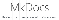

<h1>Ferramentas do Projeto</h1>

Tabela que inclui, mas não se limita às ferramentas usadas para execução destre projeto durante o semestre (sujeita a alterações):

| Nome | Descrição | Ícone |
| ---- | --------- | ----- |
| Telegram | Aplicativo de mensagem instantânea. É o canal primário de comunicação da equipe. | |
| Discord | Plataforma para comunicação que usa o Protocolo de Voz Através da Internet (VoIP). Usado para reuniões síncronas à distância. | |
| Miro | Plataforma de colaboração visual. Importante para diagramação e apresentação visual | |
| Figma | Ferramenta de design gráfico com vetores e prototipação colaborativa | |
| Github | Plataforma usada para gerenciamento de configuração e evolução de software | |
| MkDocs | Gerador de sites estáticos | |
| MkDocs-Material | Temas/Templates para o MkDocs | |

## Tabela de Versionamento

| Data | Versão | Descrição | Autor | Revisor |
| ---- | ------ | --------- | ----- | ------- |
| 04/07/2022 | `0.1`  | Criação e esboço da página de ferramentas | [Daniel Coimbra](https://github.com/DanielCoimbra) | [Natan Santana](https://github.com/Neitan2001)
| 04/07/2022 | `0.2`  | Mudança de lista para tabela. Adição de uma descrição e um ícone para cada ferramenta | [Daniel Coimbra](https://github.com/DanielCoimbra) | [Natan Santana](https://github.com/Neitan2001)
