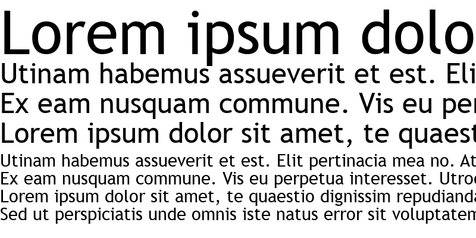
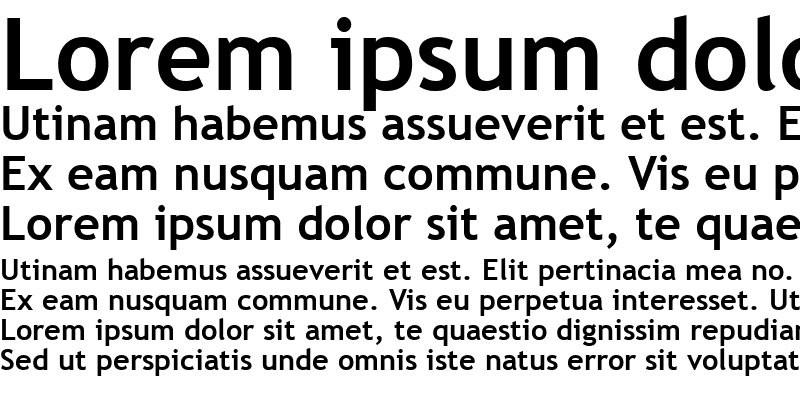

# Guia de Estilo

## Introdução

Este Guia de Estilo visa reunir os princípios e diretrizes de design que guiarão o time durante o desenvolvimento de todo o projeto. Aqui será reunido todos os elementos essenciais que deverão estar presentes na versão final do projeto, além de fornecer embasamento para tomadas de decisões sobre o design durante as próximas etapa do Processo de Design.

Grande parte dos tópicos aqui presentes são baseados no documento <a href="https://www.neoenergiaelektro.com.br/Media/Default/DocGalleries/Manual%20de%20Identidade/Novo_manual_Elektro_completo_V2.pdf" target="_blank">Elementos Básicos </a> da NeoEnergia Elektro (distribuidora do Mato Grosso do Sul) a qual, junto com a NeoEnergia Brasilia, faz parte do grupo espanhol Iberdrola. Já os elementos que não são abordados neste documento da NeoEnergia Elektro, como os Botões e Ícones, foram extraídos do site da NeoEnergia Brasília.

No final deste documento, é comparado o site Agência Virtual da NeoEnergia Brasilia com os princípios e diretrizes aqui descritos, identificando quais elementos estão em violação e precisarão de maior atenção na fase de redesign.

## Identidade Visual da NeoEnergia

### Logo

### Cores

### Tipografia 

A definição de uma tipografia é uma parte essencial do design de um produto pois a escolha de uma fonte influencia diretamente na interpretação da mensagem sendo comunicada pelo produto e marca. Como a interpretação de uma fonte é subjetiva e pode transmitir diferentes emoções, é necessário que ela se relacione diretamente com o teor das mensagens e outros elementos gráficos do design.

Sendo assim, a tipografia Trebuchet Regular (figura x) será utilizada em todos os textos do site e a fonte Trebuchet Bold (figura x) será utilizada em títulos.

Figura x: fonte Trebuchet Regular

Fonte: <a href="https://fontsgeek.com/trebuchet-ms-digiscream-font" target="_blank">Fontsgeek</a>

Figura x: fonte Trebuchet Bold

Fonte: <a href="https://fontsgeek.com/fonts/Trebuchet-MS-Bold" target="_blank">Fontsgeek</a>

### Botões

### Ícones

## Análise de estilo

### Logo

### Cores

### Tipografia

Como pode ser verificado na figura x, a tipografia que está sendo utilizada no site da Agência Virtual da NeoEnergia Brasília é a Roboto, tanto nos textos do site quanto nos títulos. Dessa forma, será necessário mudar a fonte dos textos para Trebuchet Regular e a dos títulos para Trebuchet Bold a fim de seguir o guia de estilo definido anteriormente.

Figura x: print do site Agência Virtual da Neoenergia

### Botões

### Ícones

## Bibliografia
>ELEMENTOS BÁSICOS. Disponível em: <https://www.neoenergiaelektro.com.br/Media/Default/DocGalleries/Manual%20de%20Identidade/Novo_manual_Elektro_completo_V2.pdf> - Acesso em 26/07/2022

>Quem Somos. DIsponível em: <https://www.neoenergiabrasilia.com.br/sobre-nos/sobre/Paginas/default.aspx> - Acesso em 26/07/2022

> Barbosa, S. D. J.; Silva, B. S. da; Silveira, M. S.; Gasparini, I.; Darin, T.; Barbosa, G. D. J. (2021);Interação Humano-Computador e Experiência do usuário.

>A importância da tipografia no universo do design gráfico. Disponível em: <https://www.escola-panamericana.com.br/acontece/a-importancia-da-tipografia-no-universo-do-design-grafico#:~:text=O%20tipo%20da%20fonte%20pode,marca%20e%20engajar%20o%20p%C3%BAblico.> - Acesso em 28/07/2022

## Tabela de Versionamento

| Data | Versão | Descrição | Autor | Revisor |
| :----: | :------: | :---------: | :-----: | :-------: |
| 25/07/2022 | `0.1`  | Criação de tópicos | [Natan Santana](https://github.com/Neitan2001) | [Clara Ribeiro](https://github.com/clara-ribeiro)
| 26/07/2022 | `0.2`  | Tópico de introdução | [Natan Santana](https://github.com/Neitan2001) |
| 28/07/2022 | `0.3`  | Tópico de tipografia e análise da tipografia | [Natan Santana](https://github.com/Neitan2001) | 