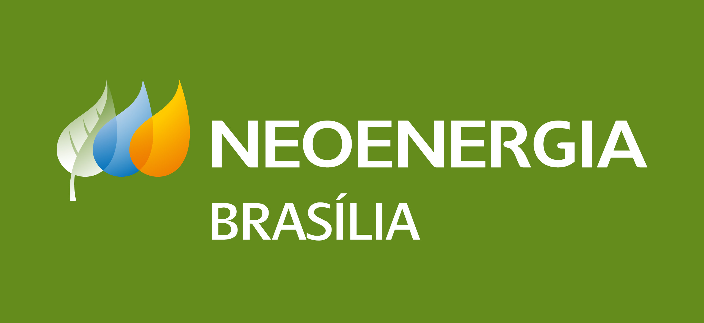

# Guia de Estilo

## Introdução

Este Guia de Estilo visa reunir os princípios e diretrizes de design que guiarão o time durante o desenvolvimento de todo o projeto. Aqui será reunido todos os elementos essenciais que deverão estar presentes na versão final do projeto, além de fornecer embasamento para tomadas de decisões sobre o design durante as próximas etapa do Processo de Design.

Grande parte dos tópicos aqui presentes são baseados no documento <a href="https://www.neoenergiaelektro.com.br/Media/Default/DocGalleries/Manual%20de%20Identidade/Novo_manual_Elektro_completo_V2.pdf" target="_blank">Elementos Básicos </a> da NeoEnergia Elektro (distribuidora do Mato Grosso do Sul) a qual, junto com a NeoEnergia Brasilia, faz parte do grupo espanhol Iberdrola. Já os elementos que não são abordados neste documento da NeoEnergia Elektro, como os Botões e Ícones, foram extraídos do site da NeoEnergia Brasília.

No final deste documento, é comparado o site Agência Virtual da NeoEnergia Brasilia com os princípios e diretrizes aqui descritos, identificando quais elementos estão em violação e precisarão de maior atenção na fase de redesign.

## Identidade Visual da NeoEnergia

### Logo

O logotipo é composto pelo símbolo e pela tipografia, havendo apenas duas variações: horizontal e vertical, como pode-se observar na figura 1. Segundo o documento da marca, a prioridade deve ser sempre para o logotipo vertical, enquanto a versão horizontal deve ser utilizada em último caso.

Figura 1: logotipos da Neoenergia

Fonte: https://www.neoenergia.com

  

Também há variações dos logotipos em negativo, caso seja necessário posiciona-los sobre um fundo mais escuro, conforme pode-se ver na figura 2.

Figura 2: logotipo negativo da Neoenergia

Fonte: https://www.neoenergia.com

  

Há uma regra de aplicação do logotipo a respeito da área de proteção em torno do mesmo. A marca deve estar rodeada por uma área de proteção mínima. Isso é necessário para que a presença do logo não seja diminuída por outros elementos. Essa área de proteção mínima pode ser observada na figura 3.

Figura 3: logotipos da Neoenergia

Fonte: https://www.neoenergiaelektro.com.br

  

### Cores

Há 3 paletas de cores na identidade visual da marca: as cores corporativas primárias, as cores corporativas secundárias e as cores verdes corporativas.

As cores corporativas primárias são: verde, azul, amarelo e laranja, conforme mostrado na figura 4. É de extrema importância que os tons usados sejam iguais ao equivalente no sistema Pantone.

Figura 4: Cores Primárias

Fonte: <a href="https://www.neoenergiaelektro.com.br/Media/Default/DocGalleries/Manual%20de%20Identidade/Novo_manual_Elektro_completo_V2.pdf" target="_blank">Manual de Identidade - Elementos Básicos</a>

  

Ao utilizar as cores, deve-se primeiro dar preferência ao verde, mas caso não seja possível, pode-se recorrer ao laranja, amarelo e azul, nessa ordem, conforme descrito no gráfico 1.

Gráfico 1: Proporção de importância das cores primárias

Fonte: <a href="https://www.neoenergiaelektro.com.br/Media/Default/DocGalleries/Manual%20de%20Identidade/Novo_manual_Elektro_completo_V2.pdf" target="_blank">Manual de Identidade - Elementos Básicos</a>

  

As cores corporativas primárias também são: verde, azul, amarelo e laranja, porém em um diferente tom, conforme mostrado na figura 5. As cores secundárias podem ser usadas para complementar as cores primárias.

Figura 5: Cores Secundárias

Fonte: <a href="https://www.neoenergiaelektro.com.br/Media/Default/DocGalleries/Manual%20de%20Identidade/Novo_manual_Elektro_completo_V2.pdf" target="_blank">Manual de Identidade - Elementos Básicos</a>

  

Ao utilizar as cores, deve-se seguir a mesma ordem de prioridade que as cores primárias: verde, laranja, amarelo e azul, nessa ordem. Podemos observar isso no gráfico 2.

Gráfico 2: Proporção de importância das cores secundárias

Fonte: <a href="https://www.neoenergiaelektro.com.br/Media/Default/DocGalleries/Manual%20de%20Identidade/Novo_manual_Elektro_completo_V2.pdf" target="_blank">Manual de Identidade - Elementos Básicos</a>

  

Pode-se observar na figura 6 as seis cores verdes coorporativas, que podem ser utilizadas para complementar as cores primárias e secundárias. A ordem de prioridade deve ser obedecida conforme descrito no gráfico 3.

Figura 6: Paleta de Verdes

Fonte: <a href="https://www.neoenergiaelektro.com.br/Media/Default/DocGalleries/Manual%20de%20Identidade/Novo_manual_Elektro_completo_V2.pdf" target="_blank">Manual de Identidade - Elementos Básicos</a>

Gráfico 3: Proporção de importância das cores verde

Fonte: <a href="https://www.neoenergiaelektro.com.br/Media/Default/DocGalleries/Manual%20de%20Identidade/Novo_manual_Elektro_completo_V2.pdf" target="_blank">Manual de Identidade - Elementos Básicos</a>

  

### Tipografia 

A definição de uma tipografia é uma parte essencial do design de um produto pois a escolha de uma fonte influencia diretamente na interpretação da mensagem sendo comunicada pelo produto e marca. Como a interpretação de uma fonte é subjetiva e pode transmitir diferentes emoções, é necessário que ela se relacione diretamente com o teor das mensagens e outros elementos gráficos do design.

Sendo assim, a tipografia Trebuchet Regular (figura 7) será utilizada em todos os textos do site e a fonte Trebuchet Bold (figura 8) será utilizada em títulos.

Figura 7: fonte Trebuchet Regular

Fonte: <a href="https://fontsgeek.com/trebuchet-ms-digiscream-font" target="_blank">Fontsgeek</a>

Figura 8: fonte Trebuchet Bold

Fonte: <a href="https://fontsgeek.com/fonts/Trebuchet-MS-Bold" target="_blank">Fontsgeek</a>

### Botões

### Ícones

## Análise de estilo

### Logo
Ao analisar o site da Agência Virtual da NeoEnergia, considerando as boas práticas de aplicação do logotipo conforme o Manual da Marca citado anteriormente, pode-se perceber uma violação na área de proteção mínima. Isso acontece na página inicial, conforme a figura 9, em que pode-se observar que o logotipo ultrapassa a área do menu.

Figura 9: Página Inicial da Agência Virtual Neoenergia

Fonte: https://agenciavirtual.neoenergiabrasilia.com.br

  

Também podemos observar o mesmo comportamento nas páginas de serviço: o logotipo ultrapassa o menu, se sobrepondo a outros elementos da página, conforme mostra a figura 10.

Figura 10: Página de Serviços da Agência Virtual Neoenergia

Fonte: https://agenciavirtual.neoenergiabrasilia.com.br/Servicos

  

### Cores

Ao analisar as cores, pode-se perceber várias violações ao manual de cores descrito anteriormente. Na página inicial as cores predominantes são Azul e Laranja. O azul utilizado não é o que foi especificado na paleta de cores da marca. Apesar do laranja estar no tom correto, ele deveria aparecer na tela apenas quando não fosse possível utilizar o verde, regra a qual não é seguida, pois o verde não aparece em nenhum momento na página inicial, a não ser na logo. Pode-se perceber isso nas figuras 11, 12 e 13. Também podemos observar nas imagens 12 e 13 que foi utilizado a cor cinza, porém ela não foi especificada nas paletas de cores da marca.

Figura 11: print da home do site Agência Virtual da Neoenergia

Figura 12: print da home do site Agência Virtual da Neoenergia

Figura 13: print da home do site Agência Virtual da Neoenergia

  

Nas páginas de serviços pode-se perceber os mesmos problemas de predominância da cor azul e ausência do verde principal, conforme ilustra a figura 14.

Figura 14: print da página de serviços do site Agência Virtual da Neoenergia

  
### Tipografia

Como pode ser verificado na figura 15, a tipografia que está sendo utilizada no site da Agência Virtual da NeoEnergia Brasília é a Roboto, tanto nos textos do site quanto nos títulos. Dessa forma, será necessário mudar a fonte dos textos para Trebuchet Regular e a dos títulos para Trebuchet Bold a fim de seguir o guia de estilo definido anteriormente.

Figura 15: print do site Agência Virtual da Neoenergia

### Botões

### Ícones

## Bibliografia
>ELEMENTOS BÁSICOS. Disponível em: <https://www.neoenergiaelektro.com.br/Media/Default/DocGalleries/Manual%20de%20Identidade/Novo_manual_Elektro_completo_V2.pdf> - Acesso em 26/07/2022

>Quem Somos. DIsponível em: <https://www.neoenergiabrasilia.com.br/sobre-nos/sobre/Paginas/default.aspx> - Acesso em 26/07/2022

> Barbosa, S. D. J.; Silva, B. S. da; Silveira, M. S.; Gasparini, I.; Darin, T.; Barbosa, G. D. J. (2021);Interação Humano-Computador e Experiência do usuário.

>A importância da tipografia no universo do design gráfico. Disponível em: <https://www.escola-panamericana.com.br/acontece/a-importancia-da-tipografia-no-universo-do-design-grafico#:~:text=O%20tipo%20da%20fonte%20pode,marca%20e%20engajar%20o%20p%C3%BAblico.> - Acesso em 28/07/2022

## Tabela de Versionamento

| Data | Versão | Descrição | Autor | Revisor |
| :----: | :------: | :---------: | :-----: | :-------: |
| 25/07/2022 | `0.1`  | Criação de tópicos | [Natan Santana](https://github.com/Neitan2001) | [Clara Ribeiro](https://github.com/clara-ribeiro)
| 26/07/2022 | `0.2`  | Tópico de introdução | [Natan Santana](https://github.com/Neitan2001) |
| 28/07/2022 | `0.3`  | Tópico de tipografia e análise da tipografia | [Natan Santana](https://github.com/Neitan2001) | 
| 28/07/2022 | `0.4`  | Tópico de logo e cores | [Clara Ribeiro](https://github.com/clara-ribeiro) | 