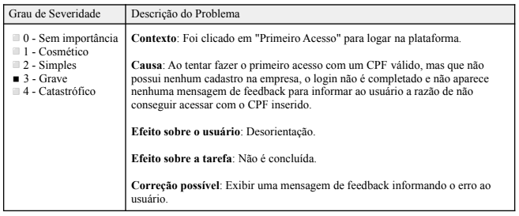
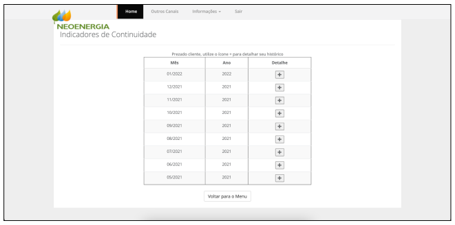
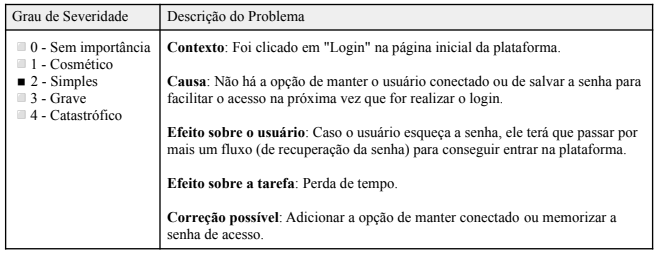
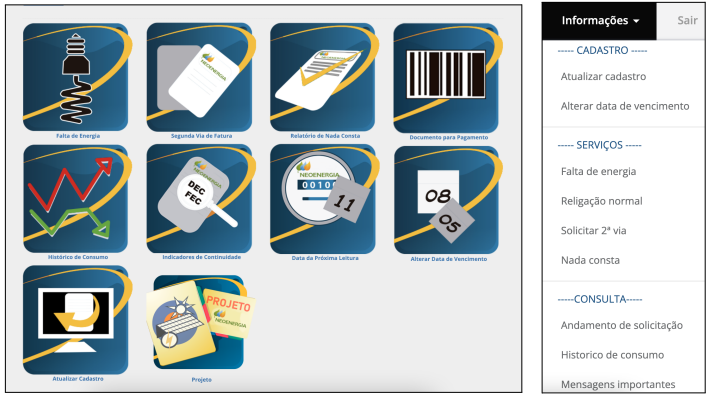
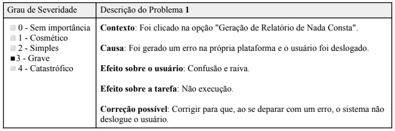
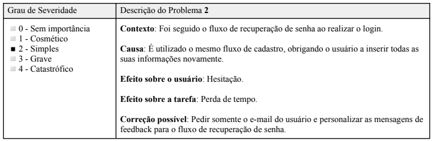
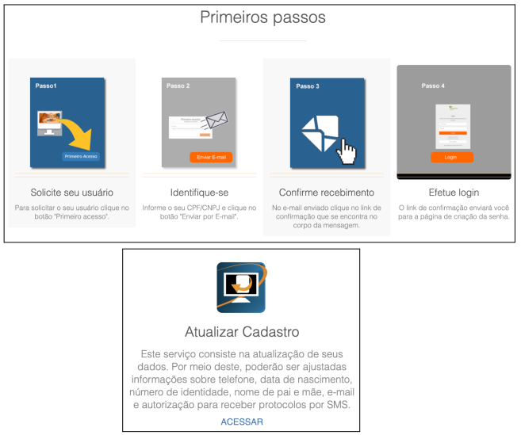

# Agência Virtual NeoEnergia

## Introdução

Para a avaliação do site da Agência Virtual foi escolhido o método da avaliação
heurística, justamente por ser um método que orienta o avaliador a inspecionar
sistematicamente a interface em busca de problemas que prejudiquem a usabilidade.
 
 
A seguir será apresentado todos os dados coletados por meio da inspeção realizada pela avaliadora Clara Marcelino Ribeiro de Sousa.

## Dados Coletados

### 1. Visibilidade do status do sistema
A seguir pode ser verificado o problema 1 encontrado na tela apresentada na Figura 1. A análise detalhada do problema está documentada na Tabela 1:

{ width="900"}

Figura 1

<b>Verificação:</b> o usuário é informado pelo sistema em tempo razoável sobre o que está acontecendo?

{ width="900"}

Tabela 1: Formulário do problema 1

### 2. Compatibilidade do sistema com o mundo real

<b>Verificação:</b> o sistema fala a linguagem do usuário utilizando palavras, frases, conceitos familiares a ele, em vez de termos orientados ao sistema?

Sim, o sistema utiliza linguagem compatível com o mundo real e de fácil entendimento

### 3. Controle do usuário e liberdade

<b>Verificação:</b> fornece maneiras de permitir que o usuário saia facilmente de lugares inesperados em que se encontram, utilizando "saídas de emergência" claramente identificadas?

Sim, em todas as páginas de um serviço específico, há a opção de retornar ao menu, como é possível observar
na Figura 2 abaixo.

Figura 2

### 4. Consistência e padrões

<b>Verificação:</b> evita fazer com que o usuário tenha que pensar se palavras, situações ou ações diferentes significam a mesma coisa?

Sim, o site segue um mesmo padrão em todas as páginas, o que facilita a navegação.

### 5. Ajuda o usuário a reconhecer, diagnosticar e recuperar-se de erros

<b>Verificação:</b> utiliza linguagem simples para descrever a natureza do problema e sugere uma maneira de
resolvê-lo?

Sim. Um bom exemplo é na tela de login, em que é informado caso o CPF inserido seja inválido. Também há
a opção de recuperação de senha.

### 6. Prevenção de erros
A seguir pode ser verificado o problema 2 encontrado na tela apresentada na Figura 3. A análise detalhada do problema está documentada na Tabela 2:

{ width="900"}

Figura 3

<b>Verificação:</b> onde possível, impede a ocorrência de erros?

{ width="900"}

Tabela 2: Formulário do problema 2

### 7. Reconhecimento em vez de memorização
<b>Verificação:</b> tornar objetos, ações e opções visíveis?

Sim, o site deixa os seus serviços bem visíveis em diversos espaços como pode ser notado na Figura 4 e 5 abaixo.

{ width="900"}

Figura 4

{ width="900"}

Figura 5

### 8. Flexibilidade e eficiência de uso
<b>Verificação:</b> fornece aceleradores invisíveis aos usuários inexperientes, os quais, no entanto, permitem aos mais experientes realizar tarefas com mais rapidez?

A seguir pode ser verificado o problema 1 desta heurística encontrado na tela apresentada na Figura 6. A análise detalhada do problema está documentada na Tabela 3:

{ width="900"}

Figura 6

{ width="900"}

Tabela 3: Formulário do problema 1 da heurísitica 8

A seguir pode ser verificado o problema 2 desta heurística encontrado na tela apresentada na Figura 7 e 8. A análise detalhada do problema está documentada na Tabela 4:

{ width="900"}

Figura 7

{ width="900"}

Figura 8

{ width="900"}

Tabela 4: Formulário do problema 2 da heurísitica 8

### 9. Estética e design minimalista

<b>Verificação:</b> evita o uso de informações irrelevantes ou raramente necessárias.

Sim, não há excesso de informações nas páginas.

### 10. Ajuda e documentação

<b>Verificação:</b> fornece informações que podem ser facilmente encontradas e ajuda mediante passos que podem ser facilmente seguidos?

Sim, há diversos conteúdos sobre o uso do sistema como pode notado na Figura 9 abaixo.

{ width="900"}

Figura 9

## Bibliografia
> Nielsen, Jakob (1994). Usability Engineering. Morgan Kaufmann Publishers Inc., San Francisco, CA, USA.

> BARBOSA, Simone. Avaliação Heurística. In: INTERAÇÃO Humano-Computador e Experiência do Usuário. [S. l.: s. n.], 2021. cap. 12, p. 282.

> MACIEL, Cristiano; NOGUEIRA, José Luis; CIUFFO, Leandro; GARCIA, Ana Cristina. Avaliação Heurística de Sítios na Web. [S. l.]

## Tabela de Versionamento

| Data | Versão | Descrição | Autor | Revisor |
| ---- | ------ | --------- | ----- | ------- |
| 16/07/2022 | `0.1`  | Criação da página de Avaliação da Agência Virtual| [Natan Santana](https://github.com/Neitan2001) | [Clara Ribeiro](https://github.com/clara-ribeiro)