# Caixa Econômica

## Introdução

Neste relatório será apresentado os resultados da avaliação do site da Caixa Econômica com o objetivo
de identificar problemas na interação e interface, detalhando onde ocorrem e uma possível solução para
melhorar a interação do usuário com a plataforma. O escopo desta análise será as telas do site principal
que podem ser acessadas sem ter uma conta criada. A seguinte avaliação foi feita analisando as
heurísticas propostas por Nielsen e identificando quais elementos estariam em violação.
 
A seguir será explicado brevemente o método de avaliação escolhido e apresentado todos os dados
coletados por meio da inspeção realizada pelo avaliador Natan Tavares Santana.

## Avaliação Heurística

A Avaliação Heurística é um método de inspeção onde um avaliador se coloca no lugar do usuário e
procura problemas na interface que podem impedir que o usuário realize o seu objetivo ou que
simplesmente cause alguma emoção negativa.
 
Assim que um problema é encontrado, é preenchido o seguinte formulário apresentando na Tabela 1:

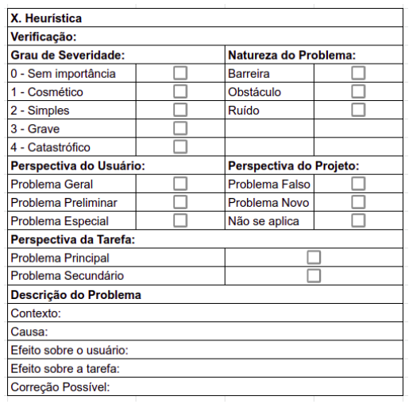

Tabela 1: Formulário base

Onde cada um dos campos significa:

- x. Heurística: Número e diretriz que o problema está violando.
- Verificação: Perguntas que verificam a validade da heurística.
- Grau de Severidade: Uma escala de 0 a 4 para classificar o problema de usabilidade, onde
    - 0 - Sem Importância: não afeta a operação da interface para todos usuários, não sendo encarado necessariamente como um problema de usabilidade.
    - 1 - Cosmético: não necessita ser reparado, a menos que haja tempo disponível.
    - 2 - Simples: pode ser reparado, com baixa prioridade de correção.
    - 3 - Grave: deve ser reparado, com alta prioridade de correção.
    - 4 - Catastrófico: deve ser reparado de qualquer forma antes do produto ser disponibilizado.
- Natureza do Problema:
    - Barreira: refere-se a um aspecto da interface no qual o usuário esbarra sucessivas vezes e não aprende a suplantá-lo. Uma barreira voltará a se apresentar ao usuário na próxima realização da tarefa.
    - Obstáculo: refere-se a um aspecto da interface no qual o usuário esbarra e aprende a suplantá-lo.
    - Ruído: refere-se a um aspecto da interface que causa uma diminuição de seu desempenho na tarefa. O usuário pode desenvolver uma má impressão do sistema.
- Perspectiva do Usuário: Quais tipos de usuário são afetados pelo problema
    - Problema Geral: qualquer tipo de usuário durante a realização de sua tarefa.
    - Problema Preliminar: usuários novatos ou intermediários durante a realização de sua tarefa.
    - Problema Especial: tipos de usuários especiais (portadores de deficiência) durante a realização de sua tarefa.
- Perspectiva do Projeto: É importante citar a existência de duas categorias de problemas que salientam os possíveis efeitos de uma revisão de projeto. Ao realizar a Avaliação Heurística pela primeira vez, esta categoria de problema não deve ser preenchida.
    - Falso Problema: refere-se a um aspecto da interface que, apesar de classificado como problema, na realidade não traz qualquer prejuízo ao usuário, nem à sua tarefa.
    - Novo: refere-se a um novo problema de usabilidade que surgiu como consequência da correção de um problema anterior.
- Perspectiva da Tarefa: Corresponde a um aspecto da interface que compromete a realização de tarefas
    - Principal: frequentes ou importantes.
    - Secundário: pouco frequentes ou pouco importantes.
- Contexto: é a situação de uso em que o problema pode ser verificado ou diagnosticado.
- Causa: refere-se ao aspecto do sistema que propicia o problema.
- Efeito sobre o usuário: corresponde à consequência da interação com o usuário, podendo haver, entre outros, sobrecarga cognitiva, desorientação ou hesitação.
- Efeito sobre a tarefa: refere-se à decorrência da ação sobre a tarefa executada, podendo ocasionar trabalho adicional, perda de dados ou perda de tempo.
- Correção possível: indica ao projetista possíveis alterações no sistema.

## Dados Coletados

### Problema 1
A seguir pode ser verificado o problema 1 encontrado na tela apresentada na Figura 1. A análise detalhada do problema está documentada na Tabela 2:

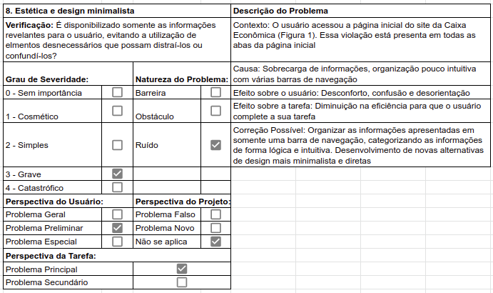{ width="900"}

Tabela 2: Formulário do problema 1

### Problema 2
A seguir pode ser verificado o problema 2 encontrado na tela apresentada na Figura 2. A análise detalhada do problema está documentada na Tabela 3:

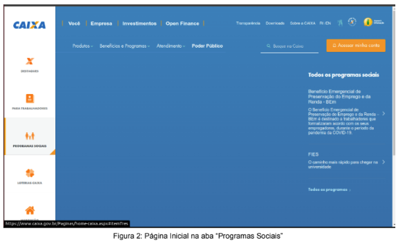

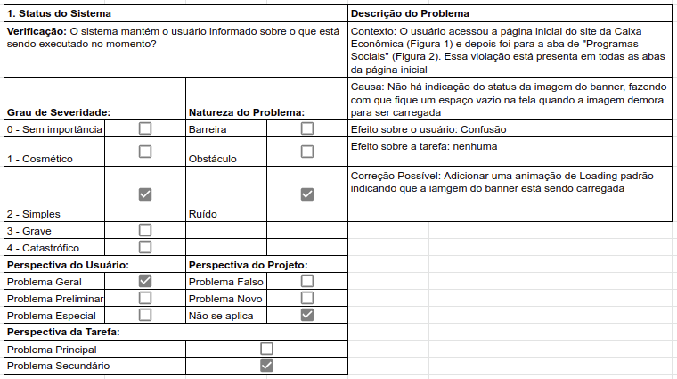{ width="900"}

Tabela 3: Formulário do problema 2

### Problema 3
A seguir pode ser verificado o problema 3 encontrado na tela apresentada na Figura 3. A análise detalhada do problema está documentada na Tabela 4:

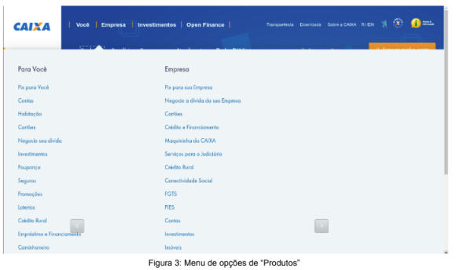

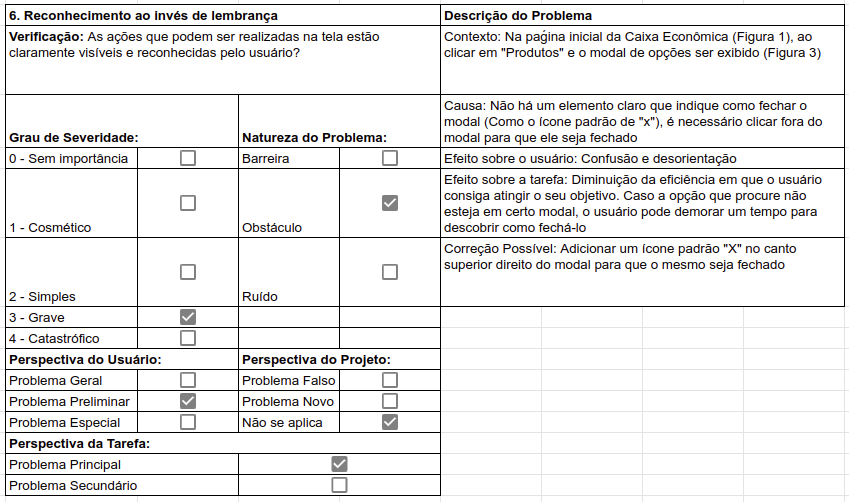{ width="900"}

Tabela 4: Formulário do problema 3

### Problema 4
A seguir pode ser verificado o problema 4 encontrado na tela apresentada na Figura 3 acima. A análise detalhada do problema está documentada na Tabela 5:

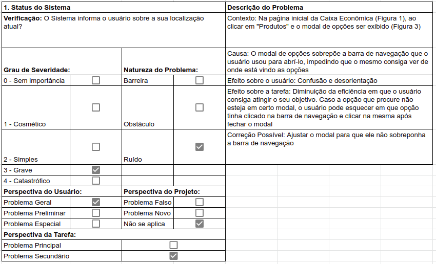{ width="900"}

Tabela 5: Formulário do problema 4

### Problema 5
A seguir pode ser verificado o problema 5 encontrado na tela apresentada na Figura 3 acima. A análise detalhada do problema está documentada na Tabela 6:

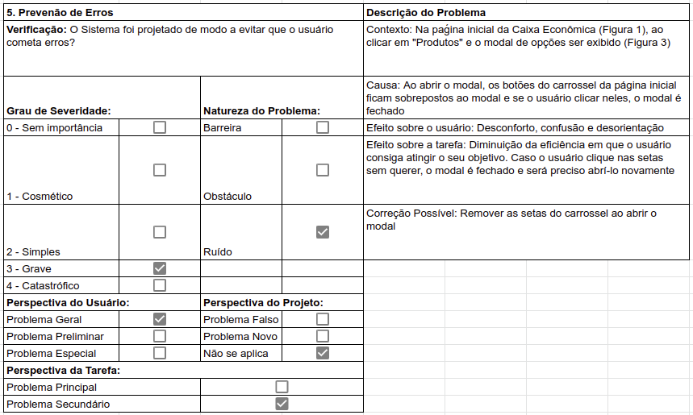{ width="900"}

Tabela 6: Formulário do problema 5

### Problema 6
A seguir pode ser verificado o problema 6 encontrado na tela apresentada na Figura 4. A análise detalhada do problema está documentada na Tabela 7:

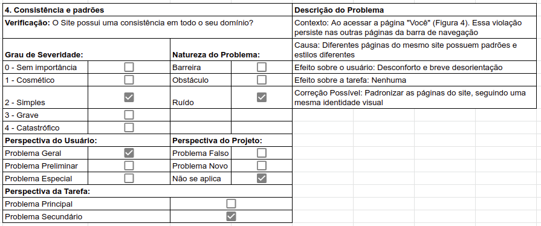{ width="900"}

Tabela 7: Formulário do problema 6

### Problema 7
A seguir pode ser verificado o problema 7 encontrado na tela apresentada na Figura 4 acima. A análise detalhada do problema está documentada na Tabela 8:

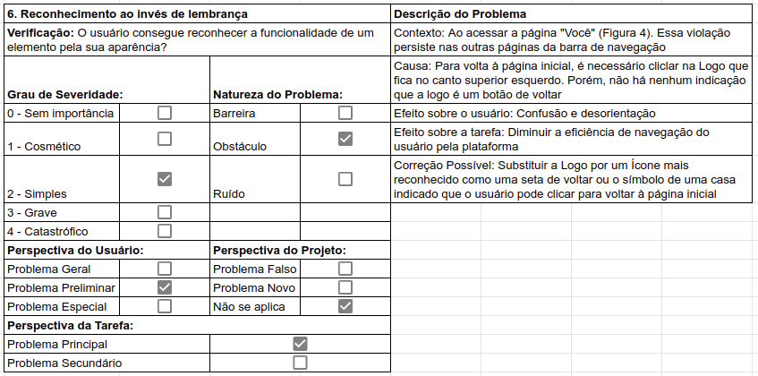{ width="900"}

Tabela 8: Formulário do problema 7

### Problema 8
A seguir pode ser verificado o problema 8 encontrado na tela apresentada na Figura 5. A análise detalhada do problema está documentada na Tabela 9:

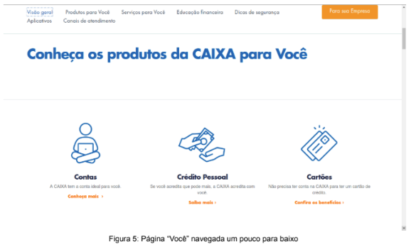

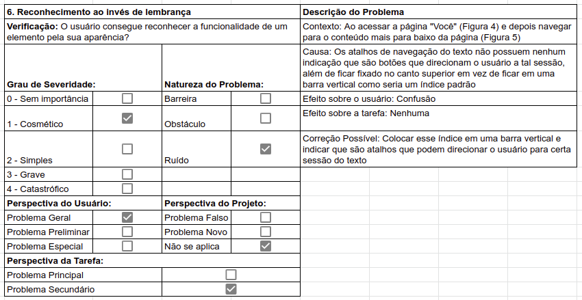{ width="900"}

Tabela 9: Formulário do problema 8

### Problema 9
A seguir pode ser verificado o problema 9 encontrado na tela apresentada na Figura 6 e Figura 7. A análise detalhada do problema está documentada na Tabela 10:

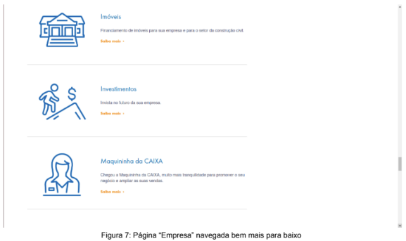

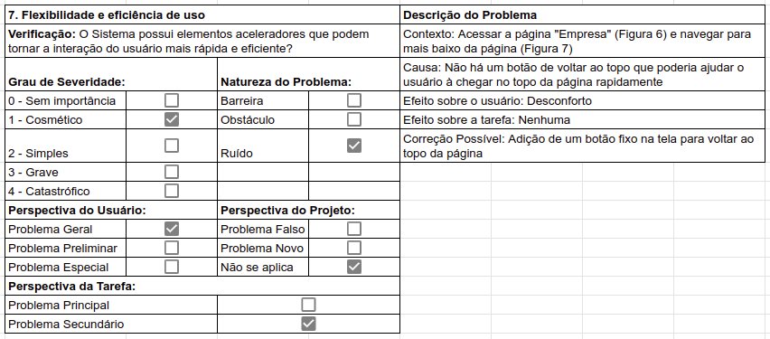{ width="900"}

Tabela 10: Formulário do problema 9

## Bibliografia
> Nielsen, Jakob (1994). Usability Engineering. Morgan Kaufmann Publishers Inc., San Francisco, CA, USA.

> BARBOSA, Simone. Avaliação Heurística. In: INTERAÇÃO Humano-Computador e Experiência do Usuário. [S. l.: s. n.], 2021. cap. 12, p. 282.

> MACIEL, Cristiano; NOGUEIRA, José Luis; CIUFFO, Leandro; GARCIA, Ana Cristina. Avaliação Heurística de Sítios na Web. [S. l.]

## Tabela de Versionamento

| Data | Versão | Descrição | Autor | Revisor |
| ---- | ------ | --------- | ----- | ------- |
| 15/07/2022 | `0.1`  | Criação da página de Avaliação da Caixa | [Natan Santana](https://github.com/Neitan2001) | 