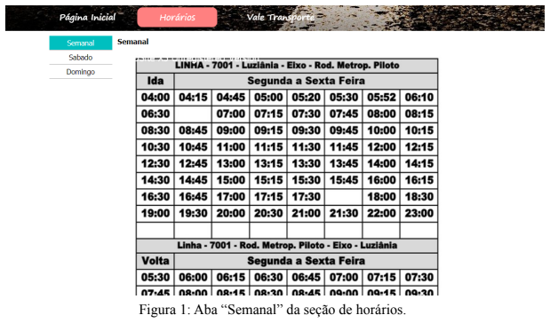
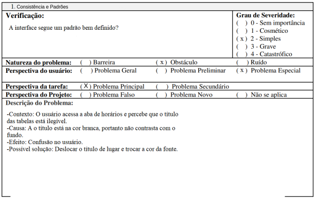
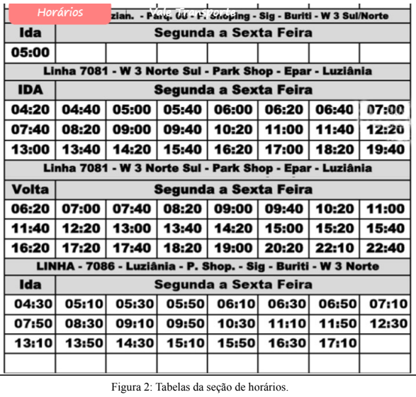
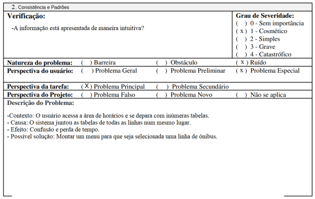

# Central Expresso

## Introdução

O site da CT Expresso tem o propósito de informar a população que faz o uso do
transporte público sobre as linhas de ônibus e seus respectivos horários, é possível também
visualizar as redes sociais da empresa e seu número de contato, além de informações sobre
vale transporte.
  
A seguir será explicado brevemente o método de avaliação escolhido e apresentado todos os dados
coletados por meio da inspeção realizada pelo avaliador Rafael Xavier Canabrava.

## Objetivo

O objetivo mais importante levantado durante a fase de planejamento é verificar se o
site é útil e intuitivo, pelo fato de que sua função é informar a população.

## Avaliação

Para a avaliação do site da Central Expresso foi escolhido o método da avaliação
heurística, justamente por ser um método que orienta o avaliador a inspecionar
sistematicamente a interface em busca de problemas que prejudiquem a usabilidade.

## Dados Coletados

### Problema 1
A seguir pode ser verificado o problema 1 encontrado na tela apresentada na Figura 1. A análise detalhada do problema está documentada na Tabela 1:

{ width="900"}

Tabela 1: Formulário do problema 1

### Problema 2
A seguir pode ser verificado o problema 2 encontrado na tela apresentada na Figura 2. A análise detalhada do problema está documentada na Tabela 2:

{ width="900"}

Tabela 2: Formulário do problema 2

## Bibliografia
> Nielsen, Jakob (1994). Usability Engineering. Morgan Kaufmann Publishers Inc., San Francisco, CA, USA.

> BARBOSA, Simone. Avaliação Heurística. In: INTERAÇÃO Humano-Computador e Experiência do Usuário. [S. l.: s. n.], 2021. cap. 12, p. 282.

> MACIEL, Cristiano; NOGUEIRA, José Luis; CIUFFO, Leandro; GARCIA, Ana Cristina. Avaliação Heurística de Sítios na Web. [S. l.]

## Tabela de Versionamento

| Data | Versão | Descrição | Autor | Revisor |
| ---- | ------ | --------- | ----- | ------- |
| 16/07/2022 | `0.1`  | Criação da página de Avaliação da Central Expresso | [Natan Santana](https://github.com/Neitan2001) | [Clara Ribeiro](https://github.com/clara-ribeiro)