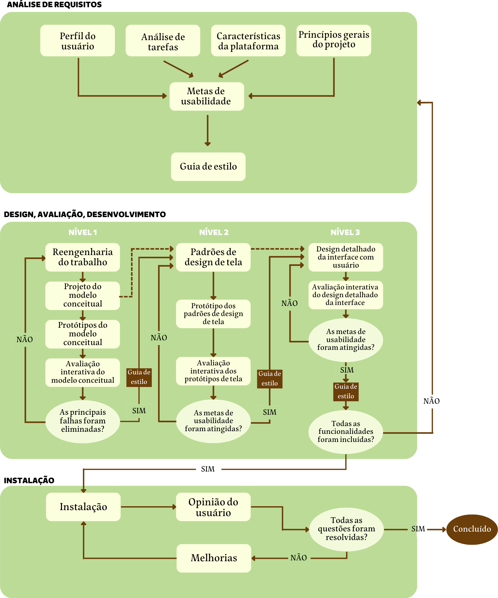

# Processo de Design

Existem diversas propostas de processos de design dentro da literatura de IHC, em que todas elas possuem as seguintes etapas em comum: análise da situação/identificação do problema, proposta de intervenção para os problemas identificados e avaliação dessa intervenção. A diferença entre cada processo de design está na forma que essas atividades básicas serão realizadas.

Um fator inerente aos processos de design é a iteratividade na execução das atividades: sempre que necessário, o designer pode recorrer às etapas anteriores do processo. Exemplificando, quando o designer está projetando uma intervenção para um problema identificado, ele é livre para retornar à etapa de análise de situação para refinar a sua proposta. Essa revisão da análise é muito importante para a elaboração de uma proposta de intervenção coerente.

Também é dado destaque à importância de ter os usuários envolvidos nas atividades de design, pois quanto mais a opinião de usuários for ouvida, mais será possível entender sobre as suas necessidades reais, ajudando na identificação e correção de problemas. (BARBOSA, 2021)

## Engenharia de Usabilidade de Mayhew

Foi proposto por Deborah Mayhew um ciclo de vida para a engenharia de usabilidade que conta com três fases: análise de requisitos, design/avaliação/desenvolvimento e instalação, como podemos ver na Imagem 2. Esse processo de design possui uma visão holística e agrupa importantes atividades de design, guiando o designer a uma boa proposta de intervenção (BARBOSA, 2021). 

<figure>
    
    <figcaption align = "center"><b>Imagem 2 - Ciclo de vida para a engenharia de usabilidade (BARBOSA, 2021).</b></figcaption>
</figure>

* Análise de requisitos: definição das metas de usabilidade, levando em conta o perfil dos usuários, análise das tarefas, possibilidades e limitações da plataforma em que o sistema será executado e princípios gerais de design de IHC.

* Design, avaliação e desenvolvimento: busca chegar em uma solução de IHC que atenda às metas de usabilidade que foram definidas na fase de análise de requisitos.

* Instalação: coleta de opiniões dos usuários após um certo tempo de uso. As informações coletadas serão utilizadas para melhorar o sistema ou até mesmo desenvolver novos sistemas interativos.

### Aplicando a Usabilidade de Mayhew na avaliação do site

O sistema avaliado já está em produção e, portanto, a análise será iniciada na fase da instalação, em que serão identificados erros e possibilidades de melhorias. Para conseguir executar tais melhorias, será necessário voltar a análise para a primeira fase de análise de requisitos, passando por todas as etapas previstas. Após a análise de requisitos, o ciclo de vida será seguido normalmente, dando início à fase de design, avaliação e desenvolvimento.

### Por que usar o ciclo de vida de Mayhew?

O ciclo de vida de Mayhew foi escolhido porque tem etapas bem definidas e detalhadas, guiando o designer de forma clara e objetiva sobre qual passo precisa dar, ao contrário do Ciclo de Vida em Estrela, por exemplo. Usar um ciclo de vida detalhado assim é vantajoso para nossa equipe pois não possuímos a experiência necessária para seguir ciclos de vida onde as etapas são mais subjetivas. 

## Bibliografia
> Barbosa, S. D. J.; Silva, B. S. da; Silveira, M. S.; Gasparini, I.; Darin, T.; Barbosa, G. D. J. (2021);Interação Humano-Computador e Experiência do usuário.

> Mayhew, D. Th e Usability Engineering Lifecycle: a practitioner’s handbook for user interface design. San Francisco, CA: Morgan Kaufmann, 1999.

## Tabela de Versionamento

| Data | Versão | Descrição | Autor | Revisor |
| ---- | ------ | --------- | ----- | ------- |
| 04/07/2022 | `0.1`  | Criação do tópico Processo de Design | [Clara Ribeiro](https://github.com/clara-ribeiro) | [Matheus Perillo](https://github.com/MatheusPerillo)
| 04/07/2022 | `0.2`  | Adição da legenda na imagem | [Clara Ribeiro](https://github.com/clara-ribeiro) | [Matheus Perillo](https://github.com/MatheusPerillo)
| 07/07/2022 | `0.3`  | Correção de bugs na documentação | [Matheus Perillo](https://github.com/MatheusPerillo) | [Clara Ribeiro](https://github.com/clara-ribeiro)
| 07/07/2022 | `0.4`  | Adição de justificativa para processo escolhido | [Rafael Xavier](https://github.com/rafaelxavierr) | [Natan Santana](https://github.com/Neitan2001)